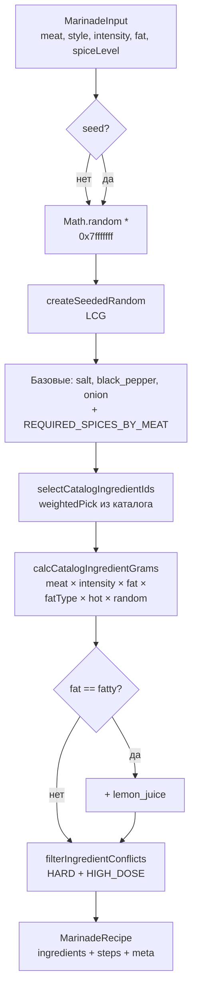

# Шашлычник.Мастер

Генератор рецептов маринада для шашлыка. Под мясо, стиль, жирность и остроту собирает сбалансированный набор специй с расчётом массы для каждой и текстовыми инструкциями.

> _Под патронажем_ **PointPuls**

[](https://github.com/mormolad/shashlik/actions/workflows/ci.yml)


---

## Что внутри

- Алгоритмический генератор маринада: правила совместимости специй, жёсткие конфликты, конфликты при высоких дозировках, требуемые специи под каждое мясо.
- Расчёт массы каждой специи с учётом мяса, интенсивности, жирности и уровня остроты.
- Полностью на CSS-переменных — никакого Tailwind, никаких сторонних UI-китов.
- i18next: русская и английская локали, ноты/шаги/имена специй уезжают через ключи, а не строки.
- Видео-фон и огненный оверлей при генерации (`framer-motion`).
- Маршрутизация: `/` (форма), `/recipes` (история, заглушка из `localStorage`), `/about`.

## Стек

| Слой           | Технологии                                                |
| -------------- | --------------------------------------------------------- |
| Runtime        | React 19, TypeScript 5.9                                  |
| Build          | Vite 7, ESLint 9, Prettier 3                              |
| Анимации       | framer-motion                                             |
| i18n           | i18next, react-i18next, language-detector                 |
| Routing        | react-router 7 (BrowserRouter)                            |
| Тесты          | Vitest 4                                                  |
| CI             | GitHub Actions (lint + typecheck + test + build, Node 20) |

## Быстрый старт

```bash
git clone git@github.com:mormolad/shashlik.git
cd shashlik
npm install
npm run dev
```

Откроется на `http://localhost:3000`.

### NPM-скрипты

| Команда              | Описание                                                    |
| -------------------- | ----------------------------------------------------------- |
| `npm run dev`        | Vite dev-сервер с HMR                                       |
| `npm run build`      | `tsc -b && vite build` — прод-сборка в `dist/`              |
| `npm run preview`    | Локальный предпросмотр прод-сборки                          |
| `npm run lint`       | ESLint по `src/**`                                          |
| `npm run typecheck`  | `tsc -b --noEmit`                                           |
| `npm run format`     | Prettier на `src/**/*.{ts,tsx,css,json}`                    |
| `npm test`           | `vitest run`                                                |
| `npm run test:watch` | Vitest в watch-режиме                                       |

## Структура проекта

```
src/
  App.tsx                  # layout: BackgroundVideo + nav + <Routes> + footer
  main.tsx                 # bootstrap: I18nextProvider + BrowserRouter
  i18n.ts                  # настройка i18next + LanguageDetector
  index.css                # дизайн-токены (CSS-переменные)
  components/
    icons/MeatIcons.tsx    # инлайновые SVG-иконки мяса
  lib/
    marinade/
      generation/
        generator.ts       # оркестратор: собирает рецепт
        select-ingredients.ts  # v2: выбор каталожных специй + filterIngredientConflicts
        calc-amounts.ts    # calcSpiceAmount, calcCatalogIngredientGrams
      ingredients/
        catalog.ts         # ЕДИНСТВЕННЫЙ источник: читает JSON, отдаёт INGREDIENT_CATALOG,
                           # getIngredientById, poolForStyleAndMeat, meatAffinityFor,
                           # INGREDIENT_HARD_CONFLICTS, buildSpiceTranslationBundles
      conflicts/
        hard.ts            # CORE/EXTRA пары + buildHardConflicts(hasIngredient)
        high-dose.ts       # HIGH_DOSE_CONFLICTS
      styles/
        profiles.ts        # STYLE_PROFILES, getStyleProfile
      data/
        spices_database.json   # массив объектов ингредиентов (id, labels, group,
                               # calcType, baseAmount, priority, allowedStyles,
                               # allowedMeats, compatibilityWeight, meatAffinity?)
      rules.ts             # все доменные коэффициенты и тюнеры
      math.ts              # seeded RNG, weightedPick, roundToHalf
      defaults.ts          # DEFAULT_SELECTIONS
      options.ts           # MEAT_VALUES, STYLE_VALUES, ...
      types.ts             # доменные типы
      __tests__/           # unit-тесты ядра
    storage/
      recipeHistory.ts     # история рецептов в localStorage
    ui/timings.ts          # GENERATION_DELAY_MS
  locales/
    ru/translation.json
    en/translation.json
  pages/
    HomePage.tsx           # форма + результат + огненный оверлей
    AboutPage.tsx
    RecipesPage.tsx        # история из localStorage
  sections/
    BackgroundVideo.tsx
    FireOverlay.tsx
    RecipeForm.tsx
    RecipeResult.tsx
  styles/
    index.css              # барель: импорты ниже
    layout.css
    nav.css
    overlays.css
    form.css
    recipe.css
    footer.css
    responsive.css         # 1024px + 720px брейкпойнты
  types/                   # пропс-интерфейсы UI
public/
  PointPuls.svg
  videos/                  # bg-coals, fire-loop, fire-celebration
```

## Как генерируется маринад



Ключевые правила живут в `src/lib/marinade/rules.ts` именованными константами:

- `MEAT_COEFFICIENT` — общий коэффициент массы по типу мяса.
- `INTENSITY_COEFFICIENT`, `FAT_GLOBAL_COEFFICIENT` — мультипликаторы интенсивности и жирности.
- `FAT_TYPE_BOOSTS` — бонус ароматным травам для постного и ярким специям для жирного.
- `RANDOM_VARIANCE`, `LEMON_JUICE_*`, `HIGH_DOSE_THRESHOLD_GRAMS` — тюнинг частных шагов. Сколько стилевых специй набирать — задаётся в профиле стиля (`StyleMarinadeTemplate.extraPickRange`).

Жёсткие пары (`conflicts/hard.ts` → `INGREDIENT_HARD_CONFLICTS` в `ingredients/catalog.ts`) и пары при высокой дозе (`conflicts/high-dose.ts`). При коллизии выбрасывается позиция с меньшим `priority` из каталога.

## Тесты

```bash
npm test
```

Покрытие ядра — `src/lib/marinade/__tests__/`:

- `math.test.ts` — `roundToHalf`, `randomBetween`, `weightedPick`, детерминизм seeded RNG.
- `generator.test.ts` — детерминизм при одинаковом seed, расхождение при разных, обязательные специи под каждое мясо, жёсткие пары из `INGREDIENT_HARD_CONFLICTS` никогда не выходят вместе (50 сидов × 5 видов мяса), `dill` не приходит при `lamb`, `lemon_juice` появляется только при `fat = 'fatty'`, `black_pepper` исчезает при `spiceLevel = 0`.

## Локализация

Все пользовательские строки лежат в `src/locales/<lang>/translation.json`. Генератор намеренно не возвращает локализованных строк: `MarinadeRecipe` хранит только ключи (`styleKey`, `marinationTimeKey`, `step.key`) и канонические имена ингредиентов (`'cumin'`, `'salt'`, ...). UI вызывает `t(...)`.

Чтобы добавить язык:

1. Создать `src/locales/<lang>/translation.json` рядом с `ru/`/`en/`.
2. Подключить в `src/i18n.ts` через `resources`.

## Дизайн-токены

`src/index.css` хранит брендовые цвета (`--void`, `--carbon`, `--ember`, `--ash`) и оверлеи как CSS-переменные. Никаких HEX/RGBA в компонентах — всё через `var(--...)`. Подробности и Figma-конвенции — в `.cursor/rules/design.mdc`.

## Деплой

`vite.config.ts` настроен на `base: './'` — собранный `dist/` можно положить на любой статический хостинг.

> При деплое на чистый статический хостинг (например, GitHub Pages без серверных rewrites) для прямого захода на `/about` или `/recipes` нужен fallback на `index.html`. Альтернатива — переход на `HashRouter`.

## Безопасность

- `.env` игнорируется через `.gitignore`. Шаблон — в `.env.example`.
- `npm audit --omit=dev` на момент последнего ревью — `0 vulnerabilities`.
- Dependabot настроен (`.github/dependabot.yml`): npm — еженедельно, github-actions — ежемесячно.

## Принципы кодовой базы

- **SOLID/SRP**: `generation/generator.ts` — только оркестратор; выбор (`generation/select-ingredients.ts`) и расчёт массы (`generation/calc-amounts.ts`) вынесены в отдельные модули; конфликты — `conflicts/`, каталог — `ingredients/`.
- **KISS**: магические числа и доменные коэффициенты — именованные константы в `rules.ts` (`LEMON_JUICE_*`, `HIGH_DOSE_THRESHOLD_GRAMS` и т.д.). Параметры стиля (множитель, количество дополнительных специй, шаги/советы) — в `styles/profiles.ts`.
- **DRY**: пользовательские строки — только в `src/locales/<lang>/translation.json`; словари `STYLE_LABELS` и `SPICE_LABELS_RU` из кода удалены.
- **i18n-first**: новые UI-строки добавляются ключом в `src/locales/<lang>/translation.json` и берутся через `t(...)`; в коде RU/EN строки не хардкодятся.
- **Стили**: только семантические классы в `src/styles/*.css` через CSS-переменные из `src/index.css`. Без Tailwind, `clsx`, `cn()` и UI-китов (см. `.cursor/rules/design.mdc`).

Полный отчёт о состоянии проекта и закрытых пунктах ревью — в [REVIEW.md](REVIEW.md).

## Лицензия

MIT
