# Ревью проекта shashlik

Чек-лист код-ревью проекта **shashlik** (Vite + React 19 + TypeScript). Проходить сверху вниз, отмечать выполненное `- [x]`. Каждый блок удобно закрывать отдельным коммитом или PR.

---

## 1. Архитектура и структура

- [ ] Лишний слой роутинга: `BrowserRouter` в [src/main.tsx](src/main.tsx) подключён, но нет ни одного `<Routes>`. [src/pages/Home.tsx](src/pages/Home.tsx) просто реэкспортирует `App`.
- [ ] Решить:  ввести реальные страницы (`/`, `/about`, `/recipes`).
- [ ] Папка [src/components/ui/](src/components/ui/) убрать
- [ ] [components.json](components.json) убрать

## 2. Доменная логика (`src/lib/marinade`)

- [x] `StyleType.quick` переименован в `'express'` — конфликт с `MarinadeTimePreference.quick` устранён.
- [x] `MarinadeInput.nationalStyle` удалён.
- [x] Магические числа вынесены в [src/lib/marinade/rules.ts](src/lib/marinade/rules.ts): `RANDOM_VARIANCE`, `LEMON_JUICE_BASE_GRAMS`, `LEMON_JUICE_VARIANCE`, `STYLE_SPICE_COUNT`, `HIGH_DOSE_THRESHOLD_GRAMS`, `MIN_SPICE_AMOUNT_GRAMS`, `SPICE_LEVEL_OFFSET`, `SPICE_LEVEL_DIVISOR`.
- [x] Seed-fallback в `generateMarinadeRecipe` сменён с `Date.now()` на `Math.floor(Math.random() * 0x7fffffff)` — лучше дисперсия при быстрых повторных вызовах.
- [x] Дублирующее правило «`dill` + `lamb`» убрано из `hasHardConflict` — оно уже описано в `HARD_CONFLICTS`.
- [x] `MarinadeMeta.userRating` удалён.
- [ ] Текст шагов рецепта (`steps`) и нот (`cutNote`/`alcoholNote`) пока остаётся захардкоженным RU — будет вынесен в i18n в коммите 9.

## 3. UI/UX слой (`src/sections`, `src/App.tsx`)

- [x] `setTimeout(1500)` вынесен в `GENERATION_DELAY_MS` ([src/lib/ui/timings.ts](src/lib/ui/timings.ts)).
- [x] ~~`handleRandomize` без нового seed~~ — оставлен, новый seed формируется внутри генератора (см. коммит 2).
- [x] `RecipeForm.onSelect` разделён на 5 узких пропсов: `onSelectMeat`, `onSelectStyle`, `onSelectIntensity`, `onSelectFat`, `onSelectSpiceLevel`.
- [x] Списки вариантов вынесены в [src/lib/marinade/options.ts](src/lib/marinade/options.ts) (`MEAT_VALUES`, `STYLE_VALUES`, `INTENSITY_VALUES`, `FAT_VALUES`). Маппинг мяса → иконка остался в `RecipeForm` как чистая UI-деталь.
- [x] `FireOverlay` уже использует `{visible && (...)}` внутри `AnimatePresence` — видео не монтируется при `visible=false` (отдельной правки не потребовалось).
- [x] [src/sections/BackgroundVideo.tsx](src/sections/BackgroundVideo.tsx): `preload="auto"` → `preload="metadata"`.

## 4. Стили (`src/styles/`, дизайн-токены)

- [x] Монолитный `src/App.css` (572 строки) разнесён на `src/styles/`: [layout.css](src/styles/layout.css), [overlays.css](src/styles/overlays.css), [form.css](src/styles/form.css), [recipe.css](src/styles/recipe.css), [footer.css](src/styles/footer.css), [responsive.css](src/styles/responsive.css). Барель — [src/styles/index.css](src/styles/index.css).
- [x] Дублей `.footer-logo-img` в финальной версии нет.
- [x] Tailwind полностью удалён в коммите 6.
- [x] Добавлен промежуточный брейкпойнт `@media (max-width: 1024px)` (планшет): уменьшается max-width контейнера, шрифт заголовка и `card-grid-4` переключается на 3 колонки.

## 5. Типы TypeScript

- [x] `React.FC` заменён на `ComponentType` (импорт из `react`) в [src/types/forms.ts](src/types/forms.ts) и в `meatOptions` [src/sections/RecipeForm.tsx](src/sections/RecipeForm.tsx).
- [x] Типы пропсов в [src/types/](src/types/) проверены — дублирующих доменных типов из `lib/marinade/types.ts` нет, файлы только реэкспортируют через `import type`.
- [x] Создан [src/lib/marinade/defaults.ts](src/lib/marinade/defaults.ts) с `DEFAULT_SELECTIONS`. `App.tsx` использует его в стартовом стейте и в `handleReset`.

## 6. Зависимости (`package.json`)

- [x] Удалить неиспользуемые пакеты: `@hookform/resolvers`, `react-hook-form`, `react-day-picker`, `date-fns`, `recharts`, `sonner`, `vaul`, `next-themes`, `embla-carousel-react`, `cmdk`, `input-otp`, `react-resizable-panels`, `zod`, `lucide-react`, все `@radix-ui/*` (`components/ui` пуст), а также Tailwind-стек (`tailwindcss`, `tailwindcss-animate`, `tw-animate-css`, `tailwind-merge`, `class-variance-authority`, `clsx`, `autoprefixer`, `postcss`).
- [x] `kimi-plugin-inspect-react` в [vite.config.ts](vite.config.ts) обёрнут в `mode === 'development'`.
- [x] Удалены файлы [tailwind.config.js](tailwind.config.js), [postcss.config.js](postcss.config.js), [components.json](components.json), [src/lib/utils.ts](src/lib/utils.ts) (использовал `clsx` + `tailwind-merge`), пустая [src/components/ui/](src/components/ui/).
- [x] Удалены директивы `@tailwind` из [src/index.css](src/index.css).
- [x] После чистки прогнан `npm install` (194 пакета удалено), bundle CSS уменьшен с 14.99 КБ до 9.21 КБ.

## 7. Производительность

- [x] Bundle: `index.js` 434 КБ (gzip 141 КБ). Цель «< 80 КБ gzip» в данном стеке нереалистична — `framer-motion` (~95 КБ gzip) используется в каждой секции. Дальнейшее уменьшение возможно только через отказ от framer-motion или замену на CSS-анимации — оставлено как осознанный trade-off.
- [x] Введён code-split для тяжёлых секций: `RecipeResult` (3.82 КБ / 0.98 КБ gzip) и `FireOverlay` (0.70 КБ / 0.39 КБ gzip) — `React.lazy` + `Suspense`. Они грузятся только при `appState !== 'form'`.
- [x] Видео-ассеты в `public/videos/` присутствуют и закоммичены: `bg-coals.mp4` (4.6 МБ), `fire-loop.mp4` (3.8 МБ), `fire-celebration.mp4` (5.7 МБ). `bg-coals.mp4` грузится с `preload="metadata"`, остальные — с `preload="none"` (грузятся только когда нужны).
- [x] `` логотипа получил `loading="lazy"` + `decoding="async"` (см. категория 8).
- [x] Каскад анимаций `SelectCard` ускорен с `delay: index * 0.04` до `0.025` — суммарная цепочка для 8 стилей сократилась с 280 мс до 175 мс.
- [ ] Lighthouse-прогон / ручной axe — оставлен пользователю как ручная проверка.

## 8. Доступность (a11y)

- [x] `aria-pressed={selected}` добавлен на `SelectCard <motion.button>` в [src/sections/RecipeForm.tsx](src/sections/RecipeForm.tsx) (сделано в коммите 3, фиксируется здесь).
- [x] Слайдер остроты получил `aria-label={t('recipe.form.sections.spiceLevel')}`.
- [x] Background-видео ([src/sections/BackgroundVideo.tsx](src/sections/BackgroundVideo.tsx)) и оба декоративных видео в [src/sections/FireOverlay.tsx](src/sections/FireOverlay.tsx), [src/sections/RecipeResult.tsx](src/sections/RecipeResult.tsx) — `aria-hidden="true"` + `tabIndex={-1}`.
- [x] `FireOverlay` обёртка снабжена `role="status"` + `aria-live="polite"` (анонсирует «генерация» неявно для скрин-ридеров).
- [x] Логотип в футере получил явные `width={140} height={34}` (по soviet viewBox 841.9×202.3) + `loading="lazy"` + `decoding="async"` — устраняет CLS.
- [ ] Контраст `--ash-text-soft` × `--carbon` — нужен ручной axe-прогон в браузере, оставлен открытым для финальной проверки в коммите 7 (perf/lighthouse).

## 9. Интернационализация (i18n)

- [x] Захардкоженные строки в [src/sections/RecipeResult.tsx](src/sections/RecipeResult.tsx) («ИНГРЕДИЕНТЫ», «ПРИГОТОВЛЕНИЕ», «Острота», «{styleLabel} маринад») заменены на `t(...)`.
- [x] Подпись в футере [src/App.tsx](src/App.tsx) → `t('footer.signature')`.
- [x] Генератор больше не возвращает RU-строки. `MarinadeRecipe.steps` стал массивом `{ key, params? }`, `MarinadeMeta` хранит `styleKey`/`marinadeTimeKey`/`cutNoteKey`/`alcoholNoteKey`. Локализация полностью на стороне UI.
- [x] `SPICE_LABELS_RU` удалён. Ингредиенты возвращают `name` = имя из `SPICE_DB` (`'cumin'`, `'salt'`, ...). UI переводит через `t(`recipe.spice.${name}`)`.
- [x] `STYLE_LABELS` и `MARINADE_TIME_LABELS` удалены из `rules.ts` — данные больше не дублируются в коде и в `translation.json`.
- [x] [src/locales/ru/translation.json](src/locales/ru/translation.json) и [src/locales/en/translation.json](src/locales/en/translation.json) дополнены: `footer.*`, `recipe.steps.*`, `recipe.notes.cut.*`, `recipe.notes.alcohol.*`, `recipe.spice.*`, `recipe.result.titleSuffix`, `recipe.result.ingredients`, `recipe.result.preparation`, полный список ключей `recipe.form.options.*`. EN-локаль доведена до полноты RU.

## 10. Безопасность

- [x] Файл `.env` содержит `FIGMA_API_KEY` — **ключ нужно отозвать в Figma** (он был засвечен в первом push'е). Создан [.env.example](.env.example) как образец. `.env` уже игнорируется через [.gitignore](.gitignore).
- [x] История проверена `git log -p` по `*.json/*.md/*.ts/*.tsx` на токены — посторонних секретов не найдено.
- [x] Добавлен [.github/dependabot.yml](.github/dependabot.yml) (npm weekly, github-actions monthly).
- [x] `npm audit --omit=dev` — **0 vulnerabilities** на момент ревью.

## 11. Качество кода (SOLID/KISS/DRY)

- [x] **SRP**: `generator.ts` разнесён по обязанностям — теперь это оркестратор, остальное вынесено:
  - [src/lib/marinade/selectSpices.ts](src/lib/marinade/selectSpices.ts) — `selectStyleSpices`, `filterConflicts`.
  - [src/lib/marinade/calcAmounts.ts](src/lib/marinade/calcAmounts.ts) — `calcSpiceAmount` + хелперы.
  - [src/lib/marinade/notes.ts](src/lib/marinade/notes.ts) — `getCutNote`, `getAlcoholNote`.
- [x] **DRY**: `getCutNote` и `getAlcoholNote` обобщены через словари (`CUT_NOTES`, `ALCOHOL_NOTES`) в [notes.ts](src/lib/marinade/notes.ts).
- [x] **KISS**: `filterConflicts` упрощена — собирает `Set` из имён к удалению одним проходом, без мутаций промежуточного массива.
- [x] [.cursor/rules/design.mdc](.cursor/rules/design.mdc) переписан под актуальную архитектуру (без Tailwind/Radix/`components/ui`, описана структура `styles/`, `sections/`, `lib/marinade/`).

## 12. Билд и инфраструктура

- [x] Скрипты в `package.json`: добавлены `typecheck`, `format`, `format:check`, `test`.
- [x] ESLint-конфиг расширен: `eslint-plugin-jsx-a11y`, `eslint-plugin-import` (с `import/order`), `no-console: warn`.
- [x] Добавлен Prettier (`.prettierrc.json`, `.prettierignore`).
- [x] Добавлен CI workflow [.github/workflows/ci.yml](.github/workflows/ci.yml): Node 20, `npm ci`, `lint`, `typecheck`, `build`.
- [x] [.gitignore](.gitignore): проверено, `dist/`, `.env`, `.cursor/` присутствуют.
- [x] `vite.config.ts` `base: './'` оставлен — норм для статики.
- [x] Удалён мёртвый хук `src/hooks/use-mobile.ts` (нигде не использовался + lint-ошибка `react-hooks/set-state-in-effect`).

## 13. Тестирование

- [x] Подключён `vitest` + [vitest.config.ts](vitest.config.ts), скрипты `test` / `test:watch` в `package.json`.
- [x] CI прогоняет `npm test` рядом с `lint` / `typecheck` / `build`.
- [x] Покрыт `math.ts`: `roundToHalf`, `randomBetween`, `weightedPick`, `createSeededRandom` — граничные случаи и детерминизм.
- [x] Покрыт `generator.ts`:
  - детерминизм при одном и том же seed,
  - расхождение при разных seed,
  - база (соль/лук) присутствует для каждого мяса,
  - **`black_pepper` отсутствует при `spiceLevel = 0`** (тест поймал реальный баг в финальной сборке — поправлено в этом же коммите),
  - обязательные специи для каждого мяса встречаются хотя бы на один из 5 сидов,
  - `HARD_CONFLICTS` никогда не выходят вместе (50 сидов × 5 видов мяса),
  - `dill` никогда не появляется при `meat = 'lamb'`,
  - `lemon_juice` появляется только при `fat = 'fatty'`,
  - все массы > 0, корректный `styleLabel`, ровно 4 шага.
- [ ] Опционально: `@testing-library/react` для smoke-теста `RecipeForm` — пропустим до отдельного запроса.

---

## Карта зон ревью

```mermaid
flowchart LR
  Domain[lib/marinade] --> Generator[generator.ts]
  Domain --> Rules[rules.ts]
  Domain --> SpiceDB[spice-db.ts]
  UI[sections] --> Form[RecipeForm.tsx]
  UI --> Result[RecipeResult.tsx]
  UI --> Overlays[FireOverlay/BackgroundVideo]
  AppTsx[App.tsx] --> UI
  AppTsx --> Domain
  AppTsx --> i18n[i18n.ts]
  Build[Build/Infra] --> Vite[vite.config.ts]
  Build --> ESLint[eslint.config.js]
  Build --> TS[tsconfig.app.json]
  Quality[Качество] --> Domain
  Quality --> UI
  A11y[A11y/i18n] --> UI
  Perf[Perf] --> UI
  Perf --> Build
  Sec[Security] --> Build
```

---

## Порядок прохождения

1. **Быстрые победы** (низкий риск, большой эффект): категории 6, 10, 12.
2. **Стабилизация ядра**: категории 2, 5, 11, 13.
3. **UI и UX**: категории 3, 4, 7, 8, 9.
4. **Финал**: категория 1 (роутинг и общая структура).
