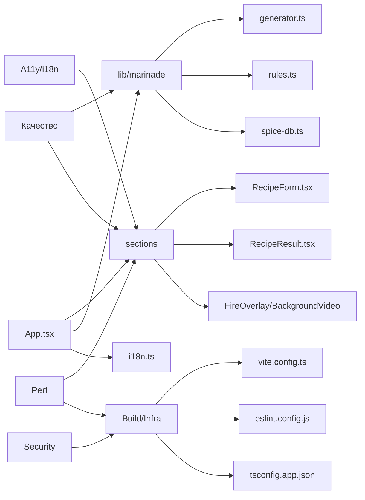

# Ревью проекта shashlik

Чек-лист код-ревью проекта **shashlik** (Vite + React 19 + TypeScript). Проходить сверху вниз, отмечать выполненное `- [x]`. Каждый блок удобно закрывать отдельным коммитом или PR.

---

## 1. Архитектура и структура

- [ ] Лишний слой роутинга: `BrowserRouter` в [src/main.tsx](src/main.tsx) подключён, но нет ни одного `<Routes>`. [src/pages/Home.tsx](src/pages/Home.tsx) просто реэкспортирует `App`.
- [ ] Решить:  ввести реальные страницы (`/`, `/about`, `/recipes`).
- [ ] Папка [src/components/ui/](src/components/ui/) убрать
- [ ] [components.json](components.json) убрать

## 2. Доменная логика (`src/lib/marinade`)

- [ ] Тип `StyleType` содержит `'quick'` ([src/lib/marinade/types.ts](src/lib/marinade/types.ts) стр. 2), хотя `quick` принадлежит `MarinadeTimePreference`. Семантическое смешение — переименовать стиль (`'express'`/`'fast'`). `quick` - это тип маринада, типа классический, кавказкий и т.д. правь с учетом этого.
- [ ] `MarinadeInput.nationalStyle` объявлен в типах, но нигде в генераторе не используется ([src/lib/marinade/generator.ts](src/lib/marinade/generator.ts)) — мёртвый параметр. убрать
- [ ] Магические числа в [generator.ts](src/lib/marinade/generator.ts): `HIGH_DOSE_THRESHOLD = 4`, `30 * randomBetween(0.95, 1.05)` для лимонного сока, `targetCount = randomBetween(2, 4)`. Вынести в `rules.ts`.
- [ ] `createSeededRandom(Date.now())` по умолчанию — детерминизма нет, при randomize рецепт может не меняться, если вызовы быстрые. Передавать seed явно.
- [ ] Конфликт «`dill` + `lamb`» захардкожен в `hasHardConflict` отдельной строкой ([generator.ts](src/lib/marinade/generator.ts) стр. 30) и одновременно лежит в `HARD_CONFLICTS` — дублирование правил.
- [ ] `MarinadeMeta.userRating` объявлен, но никем не заполняется и не читается.Удалить поле
- [ ] Текст шагов рецепта (`steps`) собирается через шаблоны прямо в генераторе — не локализуется через i18n.

## 3. UI/UX слой (`src/sections`, `src/App.tsx`)

- [ ] Магическое число `setTimeout(1500)` в [src/App.tsx](src/App.tsx) для имитации генерации — вынести в константу 
- [ ] `handleRandomize` в [src/App.tsx](src/App.tsx) вызывает `generateMarinadeRecipe(selections)` без нового seed — результат может совпадать. разница между кликами всё равно будет. 
- [ ] `RecipeForm` принимает `onSelect` как универсальный generic-колбэк — это нарушает SRP: компонент знает обо всём `MarinadeInput`. Альтернатива: отдельные `onSelectMeat`, `onSelectStyle`.
- [ ] `RecipeForm` содержит и логику опций (`meatOptions`, `styleOptions`), и презентацию — вынести опции в `lib/marinade/options.ts`.
- [ ] `FireOverlay` рендерит видео даже когда `visible=false` (через `AnimatePresence`) — оптимизировать через `mountOnEnter`.
- [ ] Background-видео в [src/sections/BackgroundVideo.tsx](src/sections/BackgroundVideo.tsx) с `preload="auto"` грузит большой файл сразу — поставить `preload="metadata"` и/или ленивую загрузку.

## 4. Стили (`src/App.css`, Tailwind, дизайн-токены)

- [ ] [src/App.css](src/App.css) — 572 строки монолитом. Разнести по файлам: `form.css`, `recipe.css`, `footer.css`, `overlays.css`.
- [ ] Дублирующийся блок `.footer-logo-img` в [src/App.css](src/App.css) — проверить, что финальная версия без дублей.
- [ ] Tailwind подключён ([tailwind.config.js](tailwind.config.js)) и настроены токены через CSS-переменные, но в реальных компонентах используются только классы `.recipe-*`, `.form-*` — Tailwind фактически мёртв. Решить: либо удалить Tailwind, либо мигрировать sections на utility-first (как требует [.cursor/rules/design.mdc](.cursor/rules/design.mdc)).
- [ ] Адаптивность ограничена `@media (max-width: 720px)` — нет промежуточных брейкпойнтов (планшет).

## 5. Типы TypeScript

- [ ] `React.FC` в `meatOptions` ([src/sections/RecipeForm.tsx](src/sections/RecipeForm.tsx) стр. 21) — устаревший паттерн, лучше `() => JSX.Element`.
- [ ] Типы пропсов ([src/types/forms.ts](src/types/forms.ts), [src/types/results.ts](src/types/results.ts), [src/types/overlays.ts](src/types/overlays.ts)) разнесены отдельно — ок, но проверить, что не дублируют доменные типы из `lib/marinade/types.ts`.
- [ ] `defaultSelections` в [src/App.tsx](src/App.tsx) с захардкоженными литералами — продублировать как `DEFAULT_SELECTIONS` из доменного слоя.

## 6. Зависимости (`package.json`)

- [x] Удалить неиспользуемые пакеты: `@hookform/resolvers`, `react-hook-form`, `react-day-picker`, `date-fns`, `recharts`, `sonner`, `vaul`, `next-themes`, `embla-carousel-react`, `cmdk`, `input-otp`, `react-resizable-panels`, `zod`, `lucide-react`, все `@radix-ui/*` (`components/ui` пуст), а также Tailwind-стек (`tailwindcss`, `tailwindcss-animate`, `tw-animate-css`, `tailwind-merge`, `class-variance-authority`, `clsx`, `autoprefixer`, `postcss`).
- [x] `kimi-plugin-inspect-react` в [vite.config.ts](vite.config.ts) обёрнут в `mode === 'development'`.
- [x] Удалены файлы [tailwind.config.js](tailwind.config.js), [postcss.config.js](postcss.config.js), [components.json](components.json), [src/lib/utils.ts](src/lib/utils.ts) (использовал `clsx` + `tailwind-merge`), пустая [src/components/ui/](src/components/ui/).
- [x] Удалены директивы `@tailwind` из [src/index.css](src/index.css).
- [x] После чистки прогнан `npm install` (194 пакета удалено), bundle CSS уменьшен с 14.99 КБ до 9.21 КБ.

## 7. Производительность

- [ ] Bundle размер: текущий `index.js` = 440 КБ (gzip 140 КБ). После чистки зависимостей цель — < 80 КБ gzip.
- [ ] Видео-ассеты: в `public/` физически нет `videos/*.mp4`, но они грузятся в [src/sections/BackgroundVideo.tsx](src/sections/BackgroundVideo.tsx), [src/sections/FireOverlay.tsx](src/sections/FireOverlay.tsx), [src/sections/RecipeResult.tsx](src/sections/RecipeResult.tsx) — отсутствуют ассеты или забыли закоммитить.
- [ ] Использовать `loading="lazy"` для `` в футере, если он не в первом экране.
- [ ] Анимации framer-motion: для `SelectCard` `delay: index * 0.04` × 7 стилей даёт цепочку 280 мс при первом рендере — допустимо, но проверить ощущение.

## 8. Доступность (a11y)

- [ ] Кнопки-карточки `<motion.button>` без `aria-pressed` для состояния «выбрано».
- [ ] Нет `<label>` или `aria-label` для слайдера остроты ([src/sections/RecipeForm.tsx](src/sections/RecipeForm.tsx)).
- [ ] Видео-фон без `aria-hidden="true"` — скрин-ридеры могут пытаться его озвучить.
- [ ] Контраст `--ash-text-soft` на `--carbon` — проверить через axe.
- [ ] `` логотипа без явных `width/height` — CLS-риск.

## 9. Интернационализация (i18n)

- [ ] [src/i18n.ts](src/i18n.ts) подключён через `LanguageDetector`, но в коде остались **захардкоженные** строки: «ИНГРЕДИЕНТЫ», «ПРИГОТОВЛЕНИЕ», «Острота», «маринад» в [src/sections/RecipeResult.tsx](src/sections/RecipeResult.tsx); «Разработано с любовью к шашлыкам и под патронажем» в [src/App.tsx](src/App.tsx).
- [ ] Шаги рецепта и ноты (`cutNote`, `alcoholNote`) собираются как строки RU прямо в генераторе — вынести ключи в локали.
- [ ] Имена специй из `SPICE_LABELS_RU` ([src/lib/marinade/spice-db.ts](src/lib/marinade/spice-db.ts)) — оставить ключи и переводить через i18n, чтобы добавить EN.
- [ ] Файл [src/locales/en/translation.json](src/locales/en/translation.json) проверить на полноту относительно `ru/translation.json`.

## 10. Безопасность

- [x] Файл `.env` содержит `FIGMA_API_KEY` — **ключ нужно отозвать в Figma** (он был засвечен в первом push'е). Создан [.env.example](.env.example) как образец. `.env` уже игнорируется через [.gitignore](.gitignore).
- [x] История проверена `git log -p` по `*.json/*.md/*.ts/*.tsx` на токены — посторонних секретов не найдено.
- [x] Добавлен [.github/dependabot.yml](.github/dependabot.yml) (npm weekly, github-actions monthly).
- [x] `npm audit --omit=dev` — **0 vulnerabilities** на момент ревью.

## 11. Качество кода (SOLID/KISS/DRY)

- [ ] **SRP**: [src/lib/marinade/generator.ts](src/lib/marinade/generator.ts) (222 строки) делает слишком много — выбор специй, расчёт количеств, форматирование, текстовые ноты. Разделить на `selectSpices.ts`, `calcAmounts.ts`, `format.ts`.
- [ ] **DRY**: `getCutNote` и `getAlcoholNote` ([src/lib/marinade/generator.ts](src/lib/marinade/generator.ts) стр. 103-114) — два почти одинаковых switch-блока, обобщить через словарь.
- [ ] **KISS**: `filterConflicts` мутирует и пересоздаёт массив 3 раза — упростить до одного `reduce`.
- [ ] [.cursor/rules/design.mdc](.cursor/rules/design.mdc) предписывает использовать `src/components/ui` как foundation, но они отсутствуют — либо привести к правилу, либо обновить правило.

## 12. Билд и инфраструктура

- [x] Скрипты в `package.json`: добавлены `typecheck`, `format`, `format:check`, `test`.
- [x] ESLint-конфиг расширен: `eslint-plugin-jsx-a11y`, `eslint-plugin-import` (с `import/order`), `no-console: warn`.
- [x] Добавлен Prettier (`.prettierrc.json`, `.prettierignore`).
- [x] Добавлен CI workflow [.github/workflows/ci.yml](.github/workflows/ci.yml): Node 20, `npm ci`, `lint`, `typecheck`, `build`.
- [x] [.gitignore](.gitignore): проверено, `dist/`, `.env`, `.cursor/` присутствуют.
- [x] `vite.config.ts` `base: './'` оставлен — норм для статики.
- [x] Удалён мёртвый хук `src/hooks/use-mobile.ts` (нигде не использовался + lint-ошибка `react-hooks/set-state-in-effect`).

## 13. Тестирование

- [ ] Тестов **0**. Минимум: добавить vitest и покрыть ядро `lib/marinade`:
  - [ ] `generator.test.ts`: при одинаковом seed одинаковый рецепт.
  - [ ] `generator.test.ts`: для каждого мяса присутствуют обязательные специи (`REQUIRED_SPICES_BY_MEAT`).
  - [ ] `generator.test.ts`: жёсткие конфликты (`HARD_CONFLICTS`) никогда не появляются вместе.
  - [ ] `generator.test.ts`: при `spiceLevel=0` черного перца нет в результате.
  - [ ] `math.test.ts`: `roundToHalf`, `weightedPick`, `randomBetween` — граничные случаи.
- [ ] Опционально: `@testing-library/react` для smoke-теста `RecipeForm`.

---

## Карта зон ревью

---

## Порядок прохождения

1. **Быстрые победы** (низкий риск, большой эффект): категории 6, 10, 12.
2. **Стабилизация ядра**: категории 2, 5, 11, 13.
3. **UI и UX**: категории 3, 4, 7, 8, 9.
4. **Финал**: категория 1 (роутинг и общая структура).
